# 🌊 Ocean View Resort – Online Room Reservation System

```
┏━━━━━━━━━━━━━━━━━━━━━━━━━━━━━━━━━━━━━━━━━━━━━━━━━━━━━━━━━━━━━━━━━━━━━━━┓
┃                                                                       ┃
┃              🌊  O C E A N   V I E W   R E S O R T  🌊               ┃
┃                                                                       ┃
┃        Online Room Reservation & Resort Management System             ┃
┃                                                                       ┃
┃     🏝 Reservations  |  📊 Dashboard  |  📑 Reports  |  💰 Billing   ┃
┃                                                                       ┃
┗━━━━━━━━━━━━━━━━━━━━━━━━━━━━━━━━━━━━━━━━━━━━━━━━━━━━━━━━━━━━━━━━━━━━━━━┛
```

```
   ___     ___   ___     _     _  _    __   __  ___   ___  __      __
  / _ \   / __| | __|   /_\   | \| |   \ \ / / |_ _| | __| \ \    / /
 | (_) | | (__  | _|   / _ \  | .` |    \ V /   | |  | _|   \ \/\/ / 
  \___/   \___| |___| /_/ \_\ |_|\_|     \_/   |___| |___|   \_/\_/  
                                                                     
         🌴 Ocean View Resort Management System 🌴
```


---

# 📖 Overview

**Ocean View Resort** is a beachside hotel located in **Galle, Sri Lanka**, which previously managed reservations manually.  
This project introduces a **Java-based web reservation system** designed to automate the entire booking workflow.

The application eliminates:

❌ Double bookings  
❌ Manual record errors  
❌ Inefficient billing calculations  

And replaces them with a **secure digital reservation platform** that enables staff to manage bookings, guests, billing, analytics, and reports efficiently.

---

# 🖥 System Preview

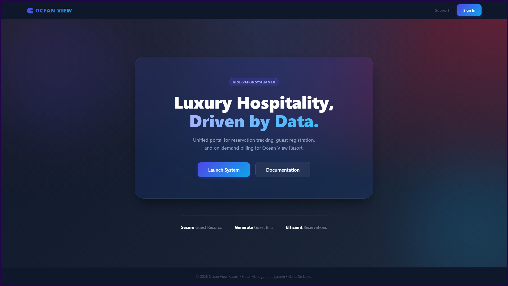
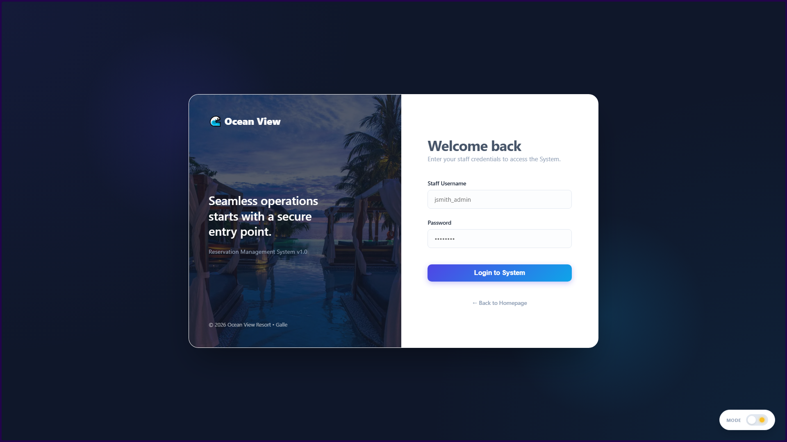
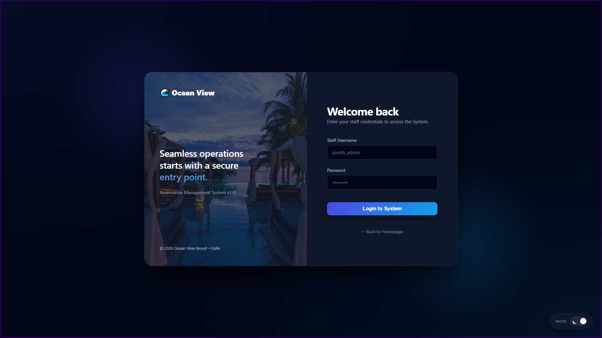
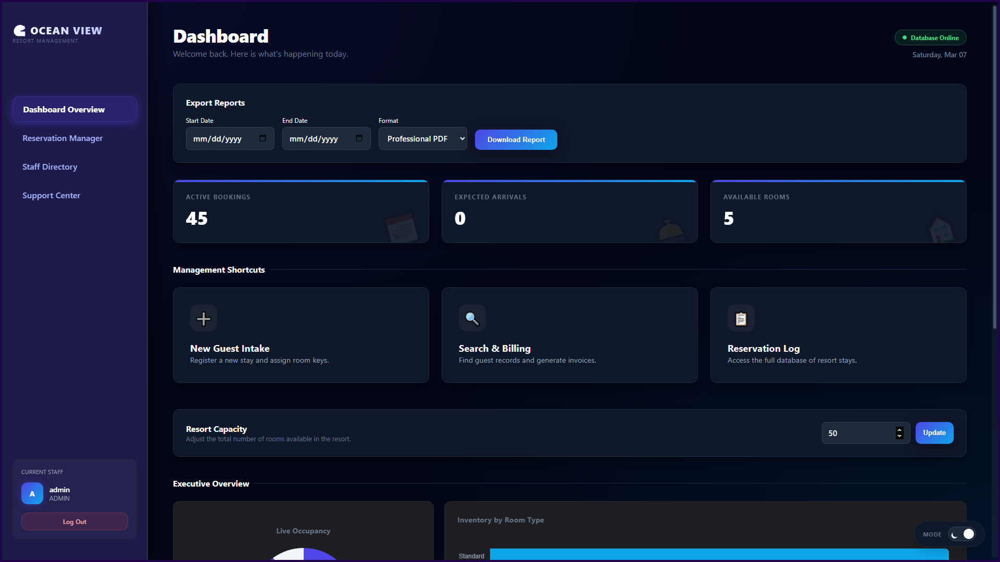
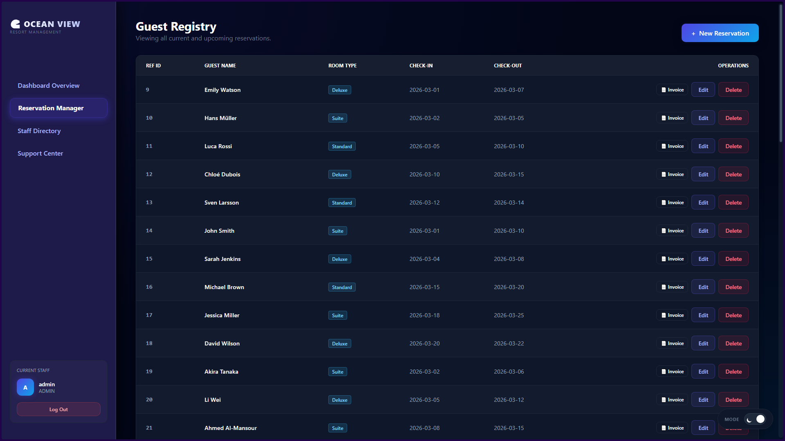
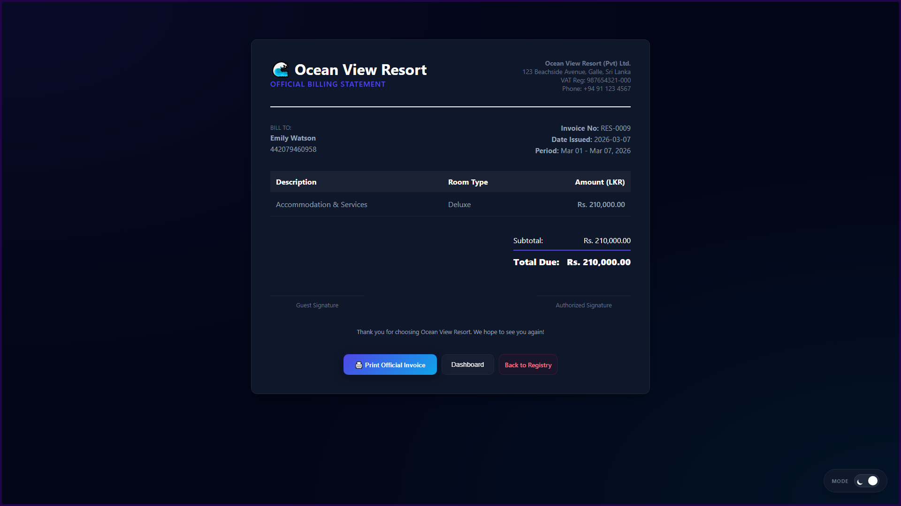

---

# 🏗 System Architecture

The system follows a **Model–View–Controller (MVC)** architecture combined with an **N-Tier design**.

```
       +----------------------+
       |    Presentation      |
       |   JSP / HTML / CSS  |
       +----------+-----------+
                  |
                  v
       +----------------------+
       |    Controller Layer  |
       |      Java Servlets   |
       +----------+-----------+
                  |
                  v
       +----------------------+
       |    Business Logic    |
       |     Service Layer    |
       +----------+-----------+
                  |
                  v
       +----------------------+
       |   Data Access Layer  |
       |      DAO Pattern     |
       +----------+-----------+
                  |
                  v
       +----------------------+
       |      MySQL DB        |
       +----------------------+
```

This architecture ensures:

✔ High maintainability  
✔ Clear separation of concerns  
✔ Easy feature extension  
✔ Scalable system structure

---

# 📁 Project Structure

```
com.oceanview
│
├── controller   → Servlets handling HTTP requests
├── service      → Business logic layer
├── dao          → Database access objects
├── model        → Entity classes (POJOs)
├── util         → Database connection utilities
├── factory      → Object creation factories
└── filter       → Authentication & security filters
```

---

# ✨ Core Features

### 🔐 Authentication System
Secure login system using **BCrypt password hashing** with role-based access.


---

### 🏨 Reservation Management
Staff can create, edit, search, and manage reservations.

✔ Guest information storage  
✔ Room type selection  
✔ Check-in & check-out tracking  
✔ Booking history retrieval  

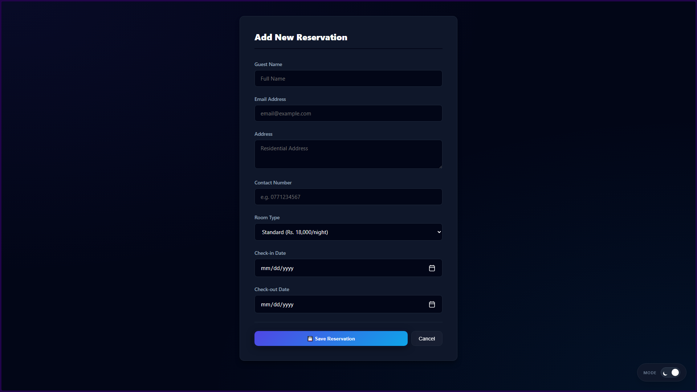

---

### 🧾 Automated Billing System

The system automatically calculates stay costs based on:

• Room type  
• Duration of stay  
• Room rates  

Bills can be **printed directly from the browser**.


---

### 📊 Interactive Dashboard

The dashboard transforms reservation data into **real-time visual analytics**.

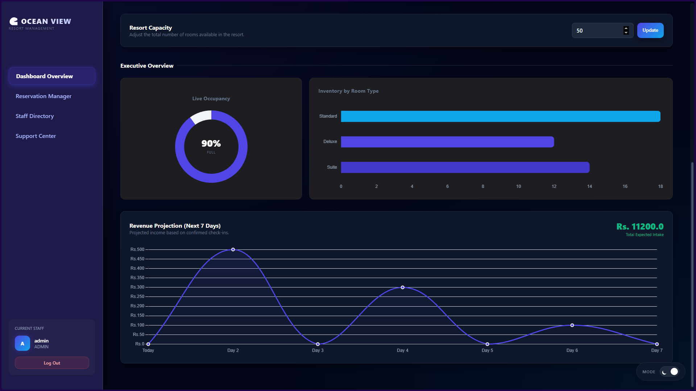

#### 📈 Occupancy Chart
Displays the **percentage of occupied rooms compared to available rooms**, helping management monitor the current capacity of the resort.

#### 🛏 Room Type Distribution Chart
Shows how many reservations exist for each room category:

• Standard  
• Deluxe  
• Suite  

This helps identify **most popular room types**.

#### 💰 Revenue Trend Chart
Displays **projected revenue for the next seven days** based on confirmed reservations, enabling financial forecasting.

These charts allow management to make **faster and data-driven decisions**.

---

# 📑 Reporting System

The system includes a **Decision-Support Reporting Module** for management analysis.

### 📊 Reservation Summary Report

Displays:

• Total reservations  
• Active bookings  
• Completed stays  

---

### 📤 Report Export

Managers can export reports in multiple formats:

✔ **CSV Export** – For spreadsheets and external analysis  
✔ **PDF Export** – For official reports and printing  

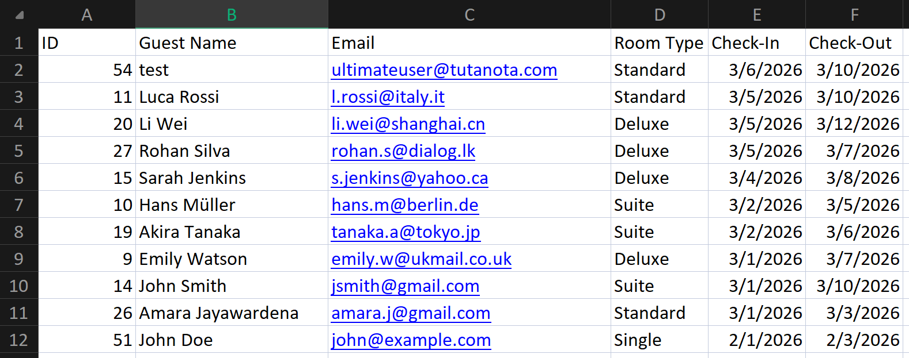

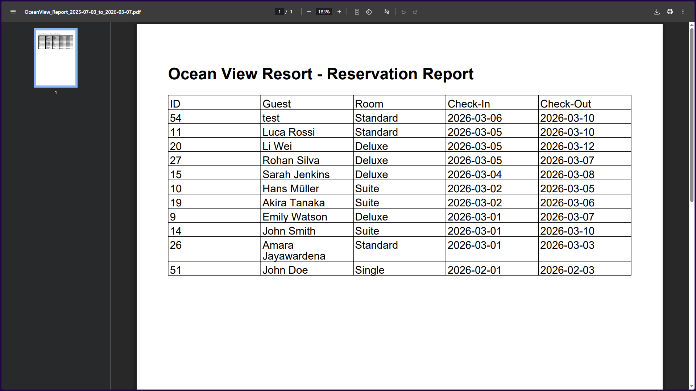

---

# ⚙️ Setup & Installation

### 1️⃣ Database Setup

Open **MySQL Workbench** and run:

```
database/ocean_view_resort.sql
```

This will create:

```
ocean_view_resort_db
```

---

### 2️⃣ Import Project

Open **Eclipse / IntelliJ IDEA**

Import as:

```
Existing Maven Project
```

---

### 3️⃣ Configure Server

Add **Apache Tomcat 10+**

Then run:

```
Right Click Project → Run on Server
```

---

# 🔑 Default Test Credentials

| Role | Username | Password |
|-----|----------|---------|
| Admin | admin | admin123 |
| Staff | staff1 | password123 |

---

# 🧠 Design Patterns Used

| Pattern | Purpose |
|------|------|
| MVC | Separates UI and business logic |
| DAO | Clean database abstraction |
| Singleton | Thread-safe DB connection |
| Factory | Object creation centralization |

---

# 🧪 Testing

The project includes **extensive automated testing using JUnit**.

Test coverage includes:

✔ Controllers  
✔ Services  
✔ DAO Layer  
✔ Filters  
✔ Utility Classes  

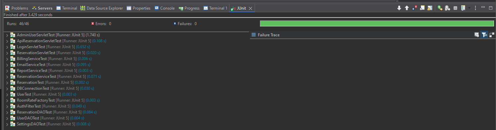

---

# 🧰 Technology Stack

| Technology | Purpose |
|-----------|--------|
| Java | Backend logic |
| JSP | Dynamic web pages |
| Servlets | Request handling |
| MySQL | Database |
| Maven | Dependency management |
| Apache Tomcat | Application server |
| JUnit | Testing framework |

---

# 🎓 Academic Context

**Module:** CIS6003 – Advanced Programming  
**Assessment:** Online Reservation System (WRIT1)  
**University:** Cardiff Metropolitan University

---

# 📜 License

This project is released under the **MIT License**.

You are free to use, modify, and distribute the software while maintaining author attribution.

---

# ⭐ Project Status

```
✔ Core Reservation System Completed
✔ Dashboard Analytics Implemented
✔ Reporting Module Implemented
✔ CSV / PDF Export Implemented
✔ Automated Testing Completed
```

---

# 🌴 Ocean View Resort System

*"Transforming resort management through modern software engineering."*

```
Developed with ☕ Java and 💙 passion
```